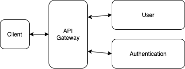
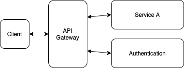

# Authentication Server 

## Goal
> Authenticate user with simple REST api.

## How to
> In this server, the authentication can be verified by jwt.

## Architecture
>> 
1. Client → API Gateway
    
    ```jsx
    {
    	id:'myId',
    	password:'password',
    }
    ```
    
2. API Gateway → User
    
    verify if it is valid id and password
    
3. User → API Gateway
    
    ```jsx
    {
    	isValid: true,
    }
    ```
    
4. API Gateway → Authentication
    
    ```jsx
    {
    	id:'myId',
    	password:'password',
    }
    ```
    
5. Authentication → API Gateway
    
    ```jsx
    {
    	accessToken: "encrypt(myId, password, secret key, 10mins)",
    	refreshToken: "encrypt(something, secret key, 2weeks)"
    }
    ```
    
6. API Gateway → Client
    
    ```jsx
    {
    	accessToken: "encrypt(myId, password, secret key, 10mins)",
    	refreshToken: "encrypt(something, secret key, 2weeks)"
    }
    ```

>> 
1. Client → API Gateway
    
    ```jsx
    {
    	header: {
    		accessToken: "encrypt(myId, password, secret key, 10mins)",
    		refreshToken: "encrypt(something, secret key, 2weeks)"
    	},
    	body: {
    		item: "something to use at service A"
    	}
    }
    ```
    
2. API Gateway → Authentication
    
    ```jsx
    {
    	accessToken: "encrypt(myId, password, secret key, 10mins)",
    	refreshToken: "encrypt(something, secret key, 2weeks)"
    }
    ```
    
3. Authentication → API Gateway
    
    ```jsx
    // if the accessToken is valid
    {
    	isValid: true,
    	accessToken: "encrypt(myId, password, secret key, 10mins)",
    	refreshToken: "encrypt(something, secret key, 2weeks)"
    }
    
    // if the accessToken is invalid && the refreshToken is valid
    {
    	isValid: false,
    	accessToken: "new encrypt(myId, password, secret key, 10mins)",
    	refreshToken: "encrypt(something, secret key, 2weeks)"
    }
    
    // if the accessToken is invalid && the refreshToken is invalid
    {
    	isValid: false,
    	accessToken: null,
    	refreshToken: null,
    }
    ```
    
4. API Gateway → Service A
    
    ```jsx
    // if accessToken is valid
    {
    	item: "something to use at service A"
    }
    
    // if accessToken is invalid
    // sending none
    ```
    
5. Service A → API Gateway
    
    ```jsx
    {
    	value: "return value from service A"
    }
    ```
    
6. API Gateway → Client
    
    ```jsx
    // if accessToken is valid
    {
    	accessToken: "encrypt(myId, password, secret key, 10mins)",
    	refreshToken: "encrypt(something, secret key, 2weeks)",
    	success: true,
    	value: "return value from service A"
    }
    
    // if the accessToken is invalid && the refreshToken is valid
    {
    	accessToken: "new encrypt(myId, password, secret key, 10mins)",
    	refreshToken: "encrypt(something, secret key, 2weeks)",
    	success: false,
    	value: "return value from service A"
    }
    
    // if the accessToken is invalid && the refreshToken is invalid
    // re-login is needed
    {
    	accessToken: null,
    	refreshToken: null,
    	success: false,
    	value: "return value from service A"
    }
    ```